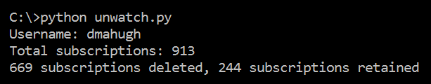

# github-unwatcher
GitHub provides a [web interface](https://github.com/watching) for managed watched repositories, and you can watch or un-watch a repo with a single click. But this takes a long time, if you have hundreds of repos to un-watch. That scenario can happen pretty easily if you've been an admin for some large and active GitHub organizations, and you've had the [Automatically Watch](https://github.com/settings/notifications) checkbox set.

I recently started a new role at Microsoft after a few years in MS Open Tech and the Open Source Programs Office, and I wanted to reduce my repo watch list to just the repos in a couple of orgs as well as my own repos. When I saw that I had over 900 repos on my watch list, I decided it would be faster to write a little script to automate this cleanup, rather than scrolling through all of those repos manually.

## Installation / Usage
Two prerequisites need to be installed:

* Python 3.x
* pip install requests

Then follow these steps:

* Clone this repo into a folder
* Create a ```credentials.txt``` that contains your GitHub username on the first line and a _personal access token_ (as available [here](https://github.com/settings/tokens)) on the second line
* Edit ```unwatch.py``` and modify the list passed to ```remove_subscriptions()``` to include the GitHub owners (orgs and/or users) for which you want to retain subscriptions. **All other subscriptions will be deleted**.
* Run the program with ```python unwatch.py```

Here's what it looked like when I ran it for my GitHub account:


